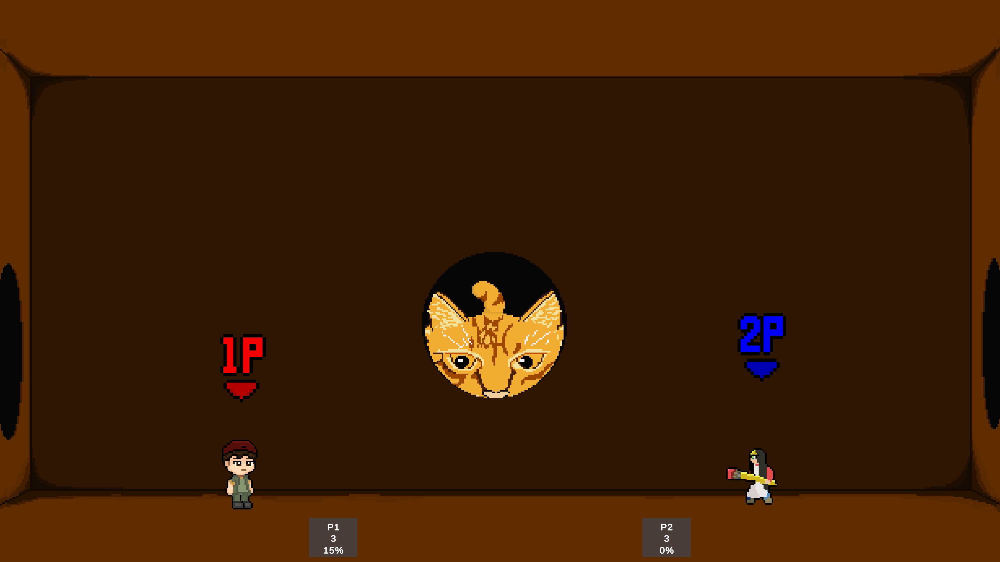
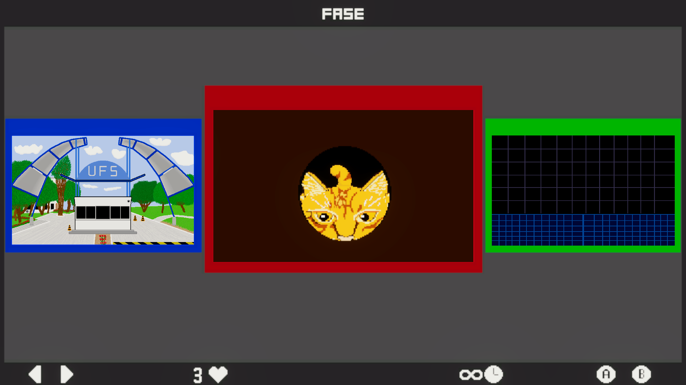
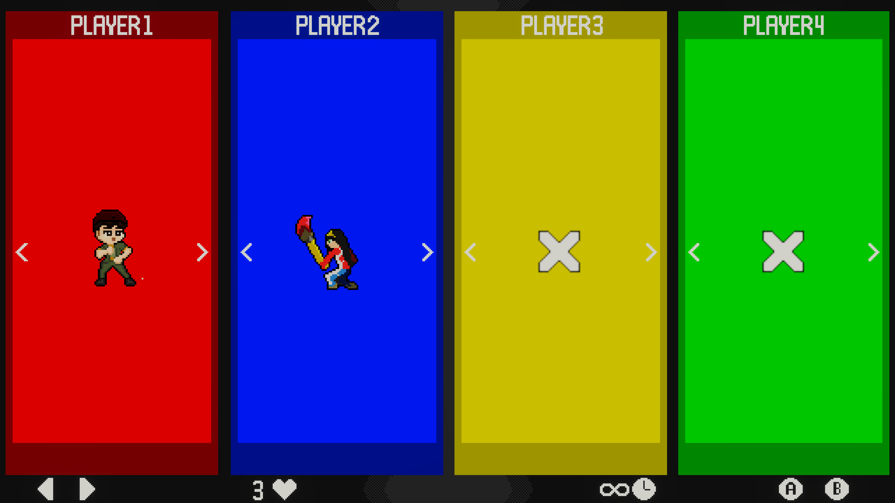

# 🎮 Ultimate FighterS

⚠️ **Este jogo ainda está em fase de desenvolvimento!**  
Funcionalidades, visuais e comportamentos estão sujeitos a mudanças.

**Ultimate FighterS** é um jogo de luta caótico onde personagens da UFS se enfrentam em combates intensos dentro do próprio campus universitário — inclusive na misteriosa *Caixa de Gato*.
Inspirado em jogos como *Smash Bros* e temperado com o humor e caos do cotidiano universitário.

---

## Pilares do Jogo

- **Controles Acessíveis**
- **Gameplay Caótica (igual à UFS)**
- **Temática Universitária — “UFS”**

---

## 🛠️ Informações Técnicas

- Projeto Unity: `#wasd-portifolio`
- **Versão da Unity utilizada**: `2022.3.38f1`

---

## 🖥️ Imagens do Jogo

### 🐱 Arena "Caixa de Gato"

### 🗺️ Seleção de Arena

### 🧍‍♂️ Seleção de Personagens

### 🧨 Tela Inicial

---

## Principais Funcionalidades

- Até **4 jogadores** simultâneos
- Seleção de **fases** e **personagens**
- Sistema de **ataques múltiplos** e **cancelamentos**
- Sistema de **dano por porcentagem** e **knockback**
- Arena interativa
- Efeitos visuais e sonoros personalizados

---
